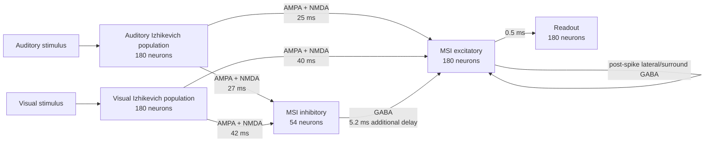

# Scientific overview

This repository contains a trained spiking-network abstraction of audiovisual
integration in the deep superior colliculus (SC). The shipped `dm10` ensemble
contains ten independently trained checkpoints (seeds 42–51). Its seven
original validation gates and the later formal Miller race-model analysis are
related but separate: formal RMI is an additional distributional analysis, not
an eighth validation gate.

## Circuit at a glance



All five populations use phenomenological Izhikevich dynamics. Integration is
at `dt = 0.1 ms`; 100 inner substeps make one 10 ms outer frame. The auditory,
visual, MSI-excitatory and readout populations each contain 180 neurons, while
the MSI-inhibitory population contains 54. The A/V projections to both MSI
populations contain fast AMPA and slow, voltage-gated NMDA components. There is
no direct A/V inhibitory shortcut to MSI-excitatory neurons: feed-forward
inhibition is the disynaptic A/V → MSI-inhibitory → MSI-excitatory path.

The inhibitory population is a PV/GABA-like modelling abstraction. It is not a
claim that every biological SC parvalbumin-positive neuron is inhibitory.
`pv_gaba_scale` scales the disynaptic inhibitory edge; `g_GABA` independently
scales post-spike lateral/surround inhibition within MSI. The shipped checkpoint
restores `tau_gaba = 18 ms`.

## Training and frozen inference

Training uses synthetic audiovisual event sequences. Excitatory feed-forward
synapses receive local timing-dependent updates, recurrent MSI excitation is
trained after its warm-up stage, and the MSI-inhibitory → MSI-excitatory edge
receives inhibitory STDP. Checkpoints store the learned state and mutable
operating-point parameters.

All results below are frozen-checkpoint measurements: plasticity is disabled,
the readouts are hash-checked, and every perturbation changes only a declared
live scalar after the checkpoint loader has restored the trained operating
point. No reported perturbation is a retraining result.

Two jitter terms must not be conflated. `sigma_dL_frames = 3` belongs to the
training and TBW event-sequence generators. The formal RMI trials instead use
the checkpoint's independent 4 ms A- and V-afferent arrival jitter;
`first_spike_latency` does not add a common-mode onset shift.

## Four different latency/time-window endpoints

| Endpoint | Definition | Interpretation |
|---|---|---|
| Gate-6 manuscript descriptor | `mean(L_A, L_V) - L_AV` | AV latency relative to the average unisensory condition mean |
| Gate-6 intensity descriptor | `min(mean L_A, mean L_V) - mean L_AV` | AV latency relative to the fastest unisensory condition mean |
| Formal Miller RMI | `G(q) = Q_bound(q) - Q_AV(q)`, where `F_bound(t) = min(F_A(t) + F_V(t), 1)` | Whether the AV latency distribution is faster than the context-invariant race bound |
| Temporal binding window (TBW) | Raw half-maximum width of the fused-response curve over audiovisual SOA | The temporal separation over which fusion persists |

The first two rows are descriptive differences between condition means. They
are not formal Miller race-model tests. A positive formal `G(q)` means the AV
quantile is earlier than the bound quantile. TBW and RMI also answer different
questions: inhibition can shape a later response and its SOA-dependent width
without changing the first population spike.

The formal endpoint is the first 0.1 ms substep at which the MSI-excitatory
population contains at least one spike. The readout population is not involved.
Silence is retained as logical `+Inf` with a finite censoring horizon rather
than being dropped.

## Formal baseline RMI

The baseline protocol measured all checkpoints 42–51 at intensities
`0.05, 0.1, 0.2, 0.4, 0.8, 1.0, 1.6`, with A, V, simultaneous AV and catch
conditions. Each checkpoint × intensity × condition cell contained 1,000
trials, SOA was 0 ms, the horizon was 400 ms, and the preregistered quantiles
were `.05, .10, …, .35`. The checkpoint—not the trial—was the inference unit;
trials and RNG substreams were never pooled across checkpoints. Family-wise
inference covered all 49 intensity × quantile cells using all 1,024 checkpoint
sign patterns.

| Intensity | Formal violations | Checkpoint-mean `G(q)` (ms) | Adjusted exact p-values |
|---|---|---|---|
| `0.05` | Every `q = .05–.35` | `17.71, 16.88, 16.41, 16.06, 15.78, 15.60, 15.42` | all `1/1024` |
| `0.10` | `q = .20, .25, .30, .35` | `0.38, 0.45, 0.48, 0.52` | `11, 1, 4, 2 / 1024` |
| `>= 0.20` | None | — | — |

Every reported violating cell had a positive approximate simultaneous lower
band, and the global max-T result was `p = 1/1024`. The sign-flip p-values are
exact over the ten checkpoint rows; the discrete max-T bands are approximate.
No nested trial-within-checkpoint bootstrap or alternate-endpoint sensitivity
was executed. Thus the large formal violation is a
near-threshold result; only a small residual remains at `I = .10` and later
quantiles. The paired descriptive inverse-effectiveness contrast was
`A+_full(.05) - A+_full(1.0) = 14.946 ms` (SE `0.292 ms`, simultaneous lower
bound `14.422 ms`, `p = 1/1024`). Here
`A+_full = integral_0^H max(F_AV(t) - F_bound(t), 0) dt`: the positive CDF-gap
area across the full horizon. It is a descriptive secondary quantity, not a
condition-mean descriptor or the formal quantile statistic.

## Frozen perturbations: screen, held-out confirmation and attribution

Seed 42 was used only to screen the declared scalar doses. It selected four
candidates for confirmation at `I = .05`. The confirmatory analysis then used
held-out checkpoints 43–51; seed 42 was excluded from inference. Exact
two-sided row-sign inference used all 512 held-out checkpoint sign patterns,
with a 28-cell primary `delta G(q)` family and a four-cell secondary
`delta A+_full` positive-CDF-area family.

| Frozen perturbation | Held-out `delta G(q)`, `q = .05–.35` (ms) | `delta A+_full` (ms) | First-spike conclusion |
|---|---|---:|---|
| `aM=.008, dM=8` | `+23.64, +23.74, +23.74, +23.78, +23.74, +23.67, +23.57` | `+23.265` | Strongly increases RMI; opposite the selected reduced-RMI direction |
| `pv_gaba_scale=0` | exactly zero at every q | `0` | No effect on this first-spike endpoint |
| `tau_gaba=10 ms` | exactly zero at every q | `0` | No effect on this first-spike endpoint |
| `gNMDA=.765` | `-17.12, -16.09, -15.41, -14.91, -14.58, -14.18, -13.89` | `-13.258` | Robustly reduces low-intensity RMI; all seven predefined directional endpoint gates pass |

Every nonzero result had adjusted `p = 2/512` and an approximate simultaneous
band excluding zero. In the exploratory seed-42 screen, every GABA strength from 0× to 4× and
every tested `tau_gaba` from 10 to 60 ms was also exactly null for RMI.
`gNMDA=0` silenced A, V and AV; `gNMDA=.255` silenced A and V while AV still
responded; and adaptation-off caused unisensory detection failure. These are
detection failures, not selective formal-RMI reductions.

The triggered attribution study separated the historical compound adaptation
change. Across checkpoints 43–51, `aM=.008, dM=10` reproduced the prior
`aM=.008, dM=8` raw first-spike outcomes exactly, while `aM=.02, dM=8`
reproduced the shipped endpoint exactly. The first-spike difference therefore
belongs to `aM`: `dM` is applied only after a spike and cannot change the first
spike from a reset state. This is an endpoint-specific attribution, not an ion-
channel identification.

## Why GABA affects TBW but not the low-intensity RMI endpoint

Dedicated RTX 5090 traces established the ordering directly. At `I=.05` and
`I=.20`, no MSI-inhibitory neuron fired within the 400 ms first-spike protocol.
At `I=.05`, shipped, `pv_gaba_scale=0`, `tau_gaba=10` and `tau_gaba=60` runs
therefore had identical first spikes; the A, V and AV medians were 68.15, 77.6
and 53.7 ms.

At `I=1`, the pathway was active but late:

| Condition | Latest MSI-excitatory first spike | First MSI-inhibitory spike | First disynaptic GABA input |
|---|---:|---:|---:|
| A | `42.9 ms` | `52.5 ms` | `57.7 ms` |
| V | `57.1 ms` | `66.8 ms` | `72.0 ms` |
| AV | `41.3 ms` | `51.3 ms` | `56.5 ms` |

The inhibitory spike followed the excitatory first response by at least
9.6–10.0 ms, then incurred the exact 5.2 ms local conduction delay. Lateral
surround GABA is generated only after an MSI-excitatory spike and first affects
the next 0.1 ms substep. Neither inhibitory path can retroactively alter the
first spike in this reset-state protocol. Both can still shape subsequent
firing, response duration and the TBW. The RMI null is consequently a timing
result, not evidence that GABA is biologically irrelevant.

## Biological comparison and limits

- The concentration of formal RMI at weak intensity qualitatively resembles
  SC inverse effectiveness, which has been measured at the single-neuron and
  circuit levels.
- Deep-SC NMDA dependence is biologically credible. The model result does not
  establish that globally increasing NMDA conductance reduces RMI in vivo, nor
  that this direction is a unique autism mechanism.
- The formal test is applied to model neural latency. Miller's test and the
  cited autism studies use human reaction time, so this is a mechanistic
  surrogate rather than a direct behavioural reproduction.
- A Miller-bound violation rejects a race model plus context invariance. It
  does not uniquely prove coactivation, an SC anatomical locus or human
  behaviour.
- Elevated `gNMDA` reproduces one reduced-facilitation endpoint seen in some
  simple nonsocial autism tasks. It is neither diagnostic nor a unique causal
  explanation.
- `aM` is a phenomenological Izhikevich recovery parameter, not a uniquely
  identified molecular current. Likewise, the 54-neuron inhibitory population
  abstracts heterogeneous SC PV circuitry.
- Delayed inhibition is consistent with evidence that SC inhibition calibrates
  later multisensory response magnitude and timing. Its first-spike null here
  should not be generalized to later spikes, TBW, other intensities or biology.

## Results, provenance and reproduction

The small committed result set contains the portable held-out and adaptation
summaries, endpoint tables, and checksums:

- [Held-out confirmation summary](../results/race_model/heldout_confirmation_summary.json)
  and [endpoint table](../results/race_model/heldout_confirmation_endpoints.csv)
- [Adaptation attribution summary](../results/race_model/adaptation_attribution_summary.json)
  and [endpoint table](../results/race_model/adaptation_attribution_endpoints.csv)
- [Committed artifact checksums](../results/race_model/artifact_manifest.sha256)
- [External archive manifest](../results/race_model/archive_manifest.json)

Raw trial records are deliberately not committed. The external, non-Git
archive has the stable ID `race_model_2026-07-13`, contains 94 entries plus
`SHA256SUMS`, and has manifest SHA-256
`a261138fa8864cf6548d26ffbe0c5226d72f4be7a3e3bfe42d9432ecba42780b`.
Set `RACE_MODEL_ARCHIVE` to that directory, then verify it with:

```bash
(cd "$RACE_MODEL_ARCHIVE" && sha256sum -c SHA256SUMS)
```

Checkpoint and seven-gate reproduction starts with:

```bash
md5sum -c CKPT_MD5.txt
bash measure/run_all.sh 42
```

Formal baseline acquisition and all CPU-only completed-protocol reanalysis
commands are listed in the [mechanism-influence file map](../mechanism_influence/README.md).
The baseline acquisition revision was `4da0644`, the tie-corrected baseline
analysis revision `7cbe8d8`, the seed-42 screen revision `ddaaae5`, held-out
confirmation `19133d6`, and triggered attribution `dbcf447`. All canonical GPU
evidence for the formal RMI, perturbation and timing analyses was acquired on
an NVIDIA GeForce RTX 5090.

The completed-acquisition hashes are immutable historical provenance. They are
tied to the recorded acquisition sources and cannot be regenerated from a
newer HEAD after loader code changes without checking out the recorded commit.
Any acquisition from current main must receive a new protocol/version and new
artifacts; the archived hashes must never be repinned to newer code.

## Primary references

- Izhikevich EM (2003), *Simple model of spiking neurons*.
  [doi:10.1109/TNN.2003.820440](https://doi.org/10.1109/TNN.2003.820440)
- Izhikevich EM, Gally JA, Edelman GM (2004), *Spike-timing dynamics of neuronal groups*.
  [doi:10.1093/cercor/bhh053](https://doi.org/10.1093/cercor/bhh053)
- Bi G-Q, Poo M-M (1998), *Synaptic modifications in cultured hippocampal neurons*.
  [doi:10.1523/JNEUROSCI.18-24-10464.1998](https://doi.org/10.1523/JNEUROSCI.18-24-10464.1998)
- D'Amour JA, Froemke RC (2015), *Inhibitory and excitatory spike-timing-dependent plasticity in the auditory cortex*.
  [doi:10.1016/j.neuron.2015.03.014](https://doi.org/10.1016/j.neuron.2015.03.014)
- Vogels TP et al. (2011), *Inhibitory plasticity balances excitation and inhibition in sensory pathways and memory networks*.
  [doi:10.1126/science.1211095](https://doi.org/10.1126/science.1211095)
- Stanford TR, Quessy S, Stein BE (2005), *Evaluating the operations underlying multisensory integration in the cat superior colliculus*.
  [doi:10.1523/JNEUROSCI.5095-04.2005](https://doi.org/10.1523/JNEUROSCI.5095-04.2005)
- Binns KE, Salt TE (1996), *Importance of NMDA receptors for multimodal integration in the deep layers of the cat superior colliculus*.
  [doi:10.1152/jn.1996.75.2.920](https://doi.org/10.1152/jn.1996.75.2.920)
- Truszkowski TLS et al. (2017), *A cellular mechanism for inverse effectiveness in multisensory integration*.
  [doi:10.7554/eLife.25392](https://doi.org/10.7554/eLife.25392)
- Miller RL, Stein BE, Rowland BA (2017), *Multisensory integration uses a real-time unisensory-multisensory transform*.
  [doi:10.1523/JNEUROSCI.2767-16.2017](https://doi.org/10.1523/JNEUROSCI.2767-16.2017)
- Kaneda K, Isa T (2013), *GABAergic mechanisms for shaping transient visual responses in the mouse superior colliculus*.
  [doi:10.1016/j.neuroscience.2012.12.061](https://doi.org/10.1016/j.neuroscience.2012.12.061)
- Villalobos CA et al. (2018), *Parvalbumin and GABA microcircuits in the mouse superior colliculus*.
  [doi:10.3389/fncir.2018.00035](https://doi.org/10.3389/fncir.2018.00035)
- Miller J (1982), *Divided attention: evidence for coactivation with redundant signals*.
  [doi:10.1016/0010-0285(82)90010-X](https://doi.org/10.1016/0010-0285(82)90010-X)
- Brandwein AB et al. (2013), *The development of multisensory integration in high-functioning autism*.
  [doi:10.1093/cercor/bhs109](https://doi.org/10.1093/cercor/bhs109)
- Ostrolenk A et al. (2019), *Reduced multisensory facilitation in adolescents and adults on the autism spectrum*.
  [doi:10.1038/s41598-019-48413-9](https://doi.org/10.1038/s41598-019-48413-9)
